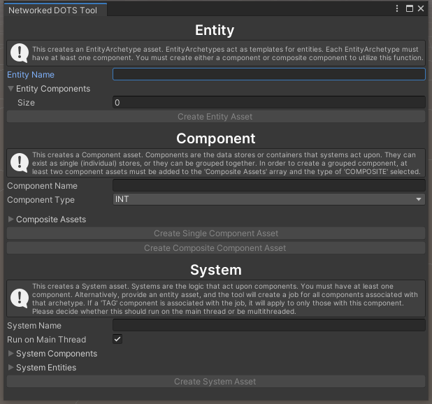

# Networked DOTS Tool
## About
[How To Use](#how-to-use) | [Networking](#networking)

This project attempts to refine the current <a href="https://github.com/Unity-Technologies/FPSSample/">FPSSample</a> and <a href="https://github.com/Unity-Technologies/DOTSSample/">DOTSSample</a> projects, which provide tools and guidance for developing networked games on the new DOTS architecture, into a lightweight version. Having used these tools previously and by researching Unity forums, I have identified a strong need for a lightwieght DOTS tool in the game development community. The current tools consist of Unity projects with fully functional examples that make them bulky and difficult to work with. These included examples increase build times and make testing difficult. Consequently, these tools are not efficient and are of little use to developers new to the DOTS architecture. This refined tool utilizes scriptable objects and a custom editor to generate the scripts necessary for ECS implementation. This allows users to more readily transition from object oriented programming to data oriented programming. Users may wish to continue using these scriptable objects to build their ECS scripts or inspect the generated scripts to get a better understanding of their structure for transitioning away from the tool. Ultimately, I hope users can come away from using this tool with a stronger understanding of DOTS ECS implementation in Unity and applying it, where applicable, to their projects.

>I highly recommend you download at least one (DOTSSample is more recent and smaller) and play around to get a feel for what is possible with DOTS architecture. Additionally, Unity has put together a <a href="unity.com/megacity">Megacity</a> where 4.5 million mesh renderers, 5000 dynamic vehicles, 100,000 unique audio sources, and 200,000 unique building objects are all in one scene. All while maintaining 60FPS! It's an amazing milestone, and can be <a href="http://megacity.unity3d.com/MegaCity_GDC2019_Release_OC.zip">downloaded here as well</a>.

## DOTS & ECS
The Data Oriented Technology Stack (DOTS) and the Entity Component System (ECS) drastically increase the performance of games developed in Unity. This performance boost permits for stable and reliable network communications necessary for immersive and consistent networked and non-networked gameplay. DOTS is comprised of three major components: the C# Job System, ECS, and a burst compiler. These in conjunction allow for processes to be split across multiple threads as opposed to them all running on the main thread. DOTS is not applicable to everything, and MonoBehaviors are not being deprecated. However, DOTS is the preferred architecture for systems that are extremely intensive such as instantiating thousands of objects and managing networked items. This project focuses on the ECS elements, as this is where the code implementation truly changes. The C# Job System and burst compiler can be obtained via installing Microsoft's Visual Studio.  Utilizing their performance boosting capabilities is simply a matter of enabling them.
### Entities
The entities are essentially lightweight GameObjects without any data that serve as placeholders or ID’s that components are assigned to. At first they may seem foreign as they have no components, not even a Transform, like that of an empty GameObject. Yet, this reduction allows for more compact storage in memory so that Systems can easily identify the Components to act upon.
### Components
The components are the actual variables that hold data. While we are currently accustomed to putting variables and logic scripts all on a singular GameObject, this is an inefficient means of storing the data in memory and leads to unoptimized applications. Therefore, only Components are associated with Entities, not the System scripts.
### Systems
Systems identify specified Components and act upon them. If you have multiple entities with a health Component, and you create a system to slowly regenerate it over time, every Entity with this component will have their health regenerated. One system can be created to update every single Component, and they do not get assigned to individual game objects. These scripts simply live in your project and utilize the job system to schedule their processes across all threads (if specified to do so) to increase efficiency. Updating the health of a thousand enemies in one scene could kill your framerate if you utilized the standard GameObject approach, each with their own individual script. These Systems can be scheduled with the C# Job System allowing for full utilization of a devices resources.
### Pure ECS vs. Hybrid ECS
Game development is uniquely visual and we have become extremely familiar with the GameObject approach to development. However, when implementing ECS, there is no need for GameObjects that represent your players or objects in the game world. Instead, Entities get instantiated at the start of playing the scene. This strict implementation of ECS without GameObjects is commonly referred to as 'Pure ECS.' Pure ECS has its applications, particularly when you're instantiating thousands of entities that you would never want to manually place.  However, this would make development extremely difficult if you couldn't visualize the scene you're designing. Consequently, Unity has been working on their GameObject to Entity conversion system. This system allows for either the use of Subscenes or Convert components to transition exisiting GameObjects into Entities with their associated Components. This conversion of GameObjects to Entities and Components is considered 'Hybrid ECS.' The conversion is not perfect, but most basic properties of a GameObject can be converted into a Component (i.e., Mesh, MeshRenderer, Translation, RigidBody, Physics, etc.). Additionally, custom Component scripts can be applied to GameObjects that your System scripts will act upon, allowing you to take full advantage of both GameObjects for visualization and ECS for optimization

This tool permits for both Pure and Hybrid ECS implementations. However, it is important to note that NetCode (the DOTS implementation of Networking) requires the hybrid approach.
## How To Use
### Requirements
[Back to Top](#about)

This project requires:
- Unity 2019.3.0f6
- Microsoft Visual Studio (2017 or 2019)

The project includes the following packages (dependencies):
- Burst 1.3.0-preview.7
- Collections 0.7.1-preview.3
- DOTS Editor 0.6.0-preview
- Entities 0.90-preview.6
- Hybrid Renderer 0.4.1-preview.6
- Jobs 0.2.8-preview.3
- Mathematics v. 1.1.0
- Unity NetCode 0.1.0-preview.6
- Unity Transport 0.3.0 - preview.6

### Installation / Navigation
To begin using the tool, download this repository and open the project in Unity.
The Netwoked DOTS Tool can be found under the Toolbar DOTS > Networked DOTS Tool.

This will open the custom editor. Seen below.

## Networking
### NetCode
[Back to Top](#about)

This project utilizes NetCode for the implementation of networking. At the time of developing this tool, this package is still in preview and fairly unstable and ever-changing.

